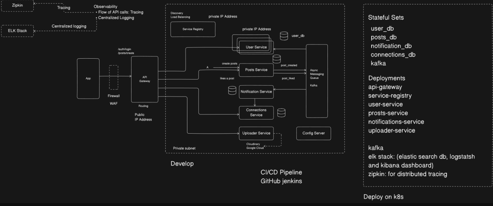
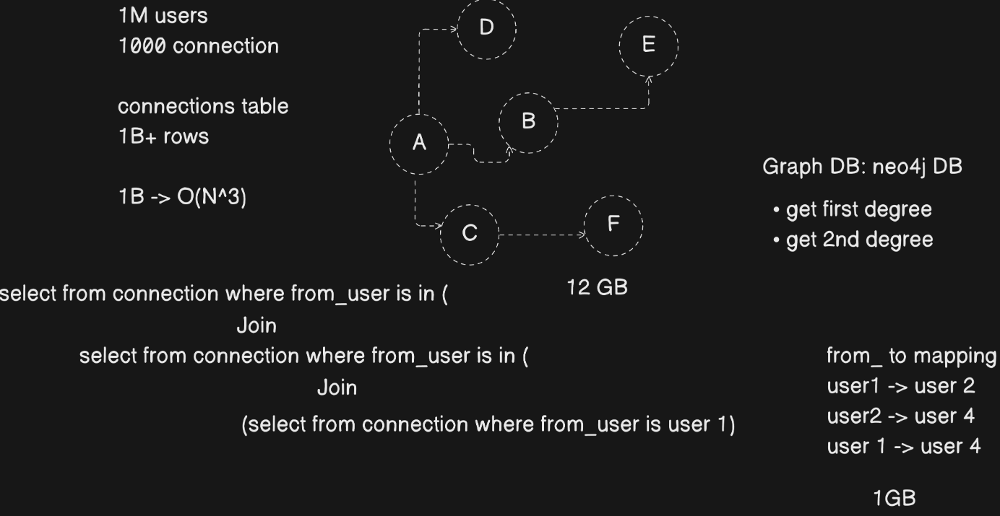

# 🌐 Distributed Networking Platform

> A **production-grade**, LinkedIn-inspired social networking platform built with a **microservices architecture**, leveraging Spring Boot, Apache Kafka, Neo4j, Kubernetes, and a full observability stack.

[](https://openjdk.org/projects/jdk/21/)
[](https://spring.io/projects/spring-boot)
[](https://spring.io/projects/spring-cloud)
[](https://kafka.apache.org/)
[](https://neo4j.com/)
[](https://www.postgresql.org/)
[](https://kubernetes.io/)
[](https://www.docker.com/)
[](LICENSE)

---

## 📋 Table of Contents

- [Overview](#-overview)
- [System Architecture](#-system-architecture)
- [Microservices](#-microservices)
- [Graph Database Design — Neo4j](#-graph-database-design--neo4j)
- [Tech Stack](#-tech-stack)
- [Key Features](#-key-features)
- [Infrastructure & DevOps](#-infrastructure--devops)
- [Observability](#-observability)
- [Getting Started](#-getting-started)
- [Kubernetes Deployment](#-kubernetes-deployment)
- [Project Structure](#-project-structure)
- [Contributing](#-contributing)

---

## 🚀 Overview

This project is a **distributed, scalable social networking backend** inspired by LinkedIn. It is designed to handle **millions of users**, supporting core social features like user profiles, post creation, real-time notifications, and a sophisticated connection graph — all running on a cloud-native Kubernetes infrastructure.

The platform is engineered with:
- **Loose coupling** via event-driven async communication (Apache Kafka)
- **Graph-powered connection discovery** using Neo4j (1st and 2nd degree connections)
- **Centralized observability** with ELK Stack + Zipkin distributed tracing
- **Secure, unified entry point** via JWT-authenticated API Gateway
- **Cloud-native deployment** on Kubernetes with StatefulSets for all databases

---

## 🏗️ System Architecture

The platform is divided into a **private subnet** (microservices + databases) exposed only through an **API Gateway** behind a **Firewall/WAF** on a public IP. All internal service-to-service communication happens over private IP addresses via **Netflix Eureka** service discovery.



### Architecture Highlights

| Layer | Component | Role |
|---|---|---|
| **Client** | Mobile / Web App | User-facing application |
| **Security** | Firewall + WAF | DDoS protection, IP filtering |
| **Gateway** | API Gateway (Spring Cloud Gateway) | JWT validation, routing, load balancing |
| **Discovery** | Eureka Service Registry | Dynamic service registration & discovery |
| **Config** | Config Server | Centralized configuration management |
| **Services** | 5 Microservices | Business logic, each with its own DB |
| **Messaging** | Apache Kafka | Async, event-driven communication |
| **Observability** | ELK + Zipkin | Logging, tracing, dashboards |
| **Deployment** | Kubernetes (k8s) | Orchestration, auto-scaling |
| **CI/CD** | GitHub + Jenkins | Automated build, test, and deploy |

---

## 🧩 Microservices

### 1. 🔑 API Gateway
**Port:** `8080`  
The single entry point for all client requests.
- Built with **Spring Cloud Gateway** (reactive, non-blocking)
- Performs **JWT token validation** before routing
- Integrates with **Eureka** for dynamic service discovery and load balancing
- Routes traffic to downstream services via private IP addresses

---

### 2. 👤 User Service
**Port:** `8081` | **DB:** PostgreSQL (`user_db`)

Handles all user identity and authentication concerns:
- User **registration & login** with BCrypt password hashing
- **JWT token issuance** (JJWT 0.12.6)
- User profile management
- Emits Kafka events on user actions (e.g., for notification triggers)
- Registered with **Eureka** for internal discovery

---

### 3. 📝 Posts Service
**Port:** `8082` | **DB:** PostgreSQL (`posts_db`)

Manages the content creation lifecycle:
- Create, read, update, delete posts
- Like/unlike posts
- Publishes **Kafka events**:
  - `post_created` — triggers notification to followers
  - `post_liked` — triggers notification to post author
- Fetches **1st-degree connections** from Connections Service via **OpenFeign** client to determine feed recipients
- Registered with **Eureka**

---

### 4. 🔔 Notification Service
**Port:** `8083` | **DB:** PostgreSQL (`notification_db`)

Event-driven notification engine:
- **Consumes Kafka events**: `post_created`, `post_liked`, connection requests
- Persists notification records to PostgreSQL
- Designed to be easily extended for push notifications, email, or WebSocket delivery
- Registered with **Eureka**

---

### 5. 🔗 Connections Service
**Port:** `8084` | **DB:** Neo4j Graph Database (`connections_db`)

The most sophisticated service — powers social graph traversal:
- Manages **connection requests**: send, accept, reject
- Retrieves **1st-degree connections** (direct connections)
- Retrieves **2nd-degree connections** (friends-of-friends) — the "People You May Know" feature
- Uses **Neo4j** as the backing store (see detailed design below)
- Exposes REST API consumed by Posts Service via OpenFeign

---

### 6. 📤 Uploader Service
**Port:** `8085`

Handles media asset management:
- Accepts file uploads (images, documents)
- Uploads to **Cloudinary** and/or **Google Cloud Storage**
- Returns CDN-accessible URLs for use in posts and profiles
- Registered with **Eureka**

---

### 7. 🗺️ Service Registry (Discover Server)
Eureka Server — the central registry where all microservices register themselves and discover each other dynamically. Eliminates hardcoded service URLs.

---

## 🕸️ Graph Database Design — Neo4j

One of the most technically interesting design decisions in this project is the use of **Neo4j** for the Connections Service.



### The Problem with Relational Databases at Scale

With **1 million users** each having an average of **1,000 connections**, a traditional relational `connections` table would have:

```
1,000,000 users × 1,000 connections = 1,000,000,000 rows (1 Billion rows)
```

Retrieving **2nd-degree connections** (friends-of-friends) using SQL requires nested joins:

```sql
SELECT * FROM connection WHERE from_user IN (
    SELECT to_user FROM connection WHERE from_user IN (
        SELECT to_user FROM connection WHERE from_user = 1
    )
)
```

This results in **O(N³) time complexity** — completely infeasible at production scale. Additionally, storing this as a relational table requires approximately **12 GB** of storage just for the connections data.

### The Neo4j Solution

Neo4j stores connections natively as a **graph** with nodes (users) and edges (relationships):

```
user1 ──CONNECTED_TO──▶ user2
user2 ──CONNECTED_TO──▶ user4
user1 ──CONNECTED_TO──▶ user4
```

**Benefits:**
| Metric | Relational DB | Neo4j |
|---|---|---|
| Storage | ~12 GB | ~1 GB |
| 1st degree query | O(N) | O(1) |
| 2nd degree query | O(N³) | O(depth) |
| Traversal complexity | Nested JOINs | Native graph traversal |

Neo4j traverses relationships in **constant time per hop**, regardless of total graph size. Fetching 2nd-degree connections becomes a simple **Cypher query** with depth-2 traversal — making the "People You May Know" feature **truly scalable** to millions of users.

---

## 🛠️ Tech Stack

### Core
| Technology | Version | Purpose |
|---|---|---|
| Java | 21 | Language runtime (LTS) |
| Spring Boot | 3.3.x / 3.4.x | Microservice framework |
| Spring Cloud | 2023.0.x / 2024.0.x | Cloud-native patterns |
| Spring Cloud Gateway | — | API Gateway (reactive) |
| Spring Cloud Netflix Eureka | — | Service discovery |
| Spring Cloud OpenFeign | — | Declarative HTTP client |
| Spring Data JPA | — | ORM for PostgreSQL |
| Spring Data Neo4j | — | ORM for Neo4j |
| Spring Kafka | — | Kafka producer/consumer |
| JJWT | 0.12.6 | JWT generation & validation |
| jBCrypt | 0.4 | Password hashing |
| ModelMapper | 3.2.0 | DTO ↔ Entity mapping |
| Lombok | — | Boilerplate reduction |

### Databases
| Database | Usage |
|---|---|
| PostgreSQL | user_db, posts_db, notification_db, connections_db (relational data) |
| Neo4j | connections_db (graph traversal) |

### Messaging
| Technology | Usage |
|---|---|
| Apache Kafka (Confluent 7.5.0) | Async event streaming between services |

### Infrastructure
| Technology | Usage |
|---|---|
| Docker | Containerization |
| Kubernetes (k8s) | Orchestration (StatefulSets + Deployments) |
| Google Jib (Maven Plugin) | Containerize without Dockerfile |
| Cloudinary | Media CDN |
| Google Cloud Storage | Object storage |

### Observability
| Technology | Usage |
|---|---|
| Zipkin | Distributed tracing |
| Elasticsearch | Log storage |
| Logstash | Log aggregation & pipeline |
| Kibana | Log visualization dashboard |

### CI/CD
| Technology | Usage |
|---|---|
| GitHub | Source control |
| Jenkins | CI/CD pipeline automation |

---

## ✨ Key Features

- 🔐 **JWT-secured API Gateway** — all requests pass through a single authenticated gateway
- 🧑‍🤝‍🧑 **Graph-based connection system** — 1st and 2nd degree connections with Neo4j
- ⚡ **Event-driven notifications** — Kafka-powered async notification delivery
- 📸 **Media uploads** — Cloudinary & Google Cloud Storage integration
- 🔍 **Service discovery** — Eureka-based dynamic routing, no hardcoded URLs
- 📊 **Full observability** — centralized logging (ELK) + distributed tracing (Zipkin)
- ☸️ **Production-grade k8s deployment** — StatefulSets for databases, Deployments for services
- 🐳 **No Dockerfile needed** — Jib Maven Plugin builds OCI images directly
- 🌐 **Ingress controller** — external routing with Kubernetes Ingress

---

## 🏭 Infrastructure & DevOps

### Kubernetes Resources

All services and databases are deployed on Kubernetes with the following resource types:

**StatefulSets** (persistent, ordered pods):
- `user_db` (PostgreSQL)
- `posts_db` (PostgreSQL)
- `notification_db` (PostgreSQL)
- `connections_db` (Neo4j)
- `kafka` (Confluent, 2 replicas)

**Deployments** (stateless microservices):
- `api-gateway`
- `service-registry`
- `user-service`
- `posts-service`
- `notifications-service`
- `connections-service`
- `uploader-service`

**Ingress:**
- Routes external HTTP traffic to the API Gateway

### Container Images

Images are built using the **Google Jib Maven Plugin** (no Docker daemon required) and pushed to Docker Hub:

```
docker.io/pradeep102005/linkedin-app-{service-name}:latest
```

Build & push with:
```bash
mvn package -DskipTests
```

---

## 👁️ Observability

### Distributed Tracing — Zipkin
All API calls are traced end-to-end across microservices. Each request gets a unique trace ID that can be searched in the Zipkin UI to identify latency bottlenecks.

### Centralized Logging — ELK Stack
- **Logstash** aggregates logs from all services
- **Elasticsearch** indexes and stores logs
- **Kibana** provides a rich dashboard for log search, filtering, and alerting

### Health Checks
All services expose Spring Boot Actuator endpoints (`/actuator/health`) monitored by Kubernetes liveness and readiness probes.

---

## 🚀 Getting Started

### Prerequisites
- Java 21+
- Maven 3.8+
- Docker & Docker Compose (for local development)
- `kubectl` + a running Kubernetes cluster (for production)

### Running Locally

1. **Clone the repository:**
```bash
git clone https://github.com/Pradeep102005/Distributed-Networking-Platform.git
cd Distributed-Networking-Platform/linkedInProject
```

2. **Start infrastructure (Kafka, PostgreSQL, Neo4j):**
```bash
docker-compose up -d
```

3. **Start services in order:**
```bash
# 1. Service Registry (Eureka)
cd DiscoverServer && mvn spring-boot:run &

# 2. User Service
cd ../userService && mvn spring-boot:run &

# 3. Connections Service
cd ../ConnectionsService && mvn spring-boot:run &

# 4. Posts Service
cd ../postsService && mvn spring-boot:run &

# 5. Notification Service
cd ../notification-service && mvn spring-boot:run &

# 6. Uploader Service
cd ../uploader-service && mvn spring-boot:run &

# 7. API Gateway (last)
cd ../APIGateway && mvn spring-boot:run &
```

4. **Access the platform via API Gateway:**
```
http://localhost:8080
```

---

## ☸️ Kubernetes Deployment

All Kubernetes manifests are in the `k8s/` directory.

```bash
# Deploy all services and infrastructure
kubectl apply -f k8s/

# Verify all pods are running
kubectl get pods

# Check services
kubectl get svc

# Access via ingress
kubectl get ingress
```

### Deploy individual components:
```bash
kubectl apply -f k8s/user-db.yml
kubectl apply -f k8s/user-service.yml
kubectl apply -f k8s/kafka.yml
# ... etc.
```

---

## 📁 Project Structure

```
Distributed-Networking-Platform/
└── linkedInProject/
    ├── APIGateway/               # Spring Cloud Gateway + JWT auth
    │   └── src/
    ├── DiscoverServer/           # Netflix Eureka Service Registry
    │   └── src/
    ├── userService/              # User registration, login, JWT
    │   └── src/
    ├── postsService/             # Post CRUD + Kafka events
    │   └── src/
    ├── notification-service/     # Kafka consumer → notification storage
    │   └── src/
    ├── ConnectionsService/       # Neo4j graph-based connections
    │   └── src/
    ├── uploader-service/         # Cloudinary/GCS media upload
    │   └── src/
    ├── k8s/                      # Kubernetes manifests
    │   ├── api-gateway.yml
    │   ├── user-service.yml
    │   ├── posts-service.yml
    │   ├── connections-service.yml
    │   ├── connections-db.yml    # Neo4j StatefulSet
    │   ├── notification-service.yml
    │   ├── notification-db.yml
    │   ├── uploader-service.yml
    │   ├── user-db.yml
    │   ├── posts-db.yml
    │   ├── kafka.yml             # Confluent Kafka StatefulSet (2 replicas)
    │   └── ingress.yml
    └── docs/
        └── images/
            ├── system_architecture.png
            └── neo4j_graph.png
```

---

## 👨‍💻 Author

**Pradeep Palakodeti**

This project was designed and built entirely from scratch as a deep-dive into distributed systems, microservices architecture, and cloud-native engineering.

- 🐙 GitHub: [@Pradeep102005](https://github.com/Pradeep102005)
- 📧 Email: pradeeppalakodeti24@gmail.com

If you find this project useful or interesting, feel free to ⭐ star the repository!

---

## 📄 License

This project is licensed under the MIT License. See the [LICENSE](LICENSE) file for details.

---

<div align="center">

**Built with ❤️ using Spring Boot, Kafka, Neo4j, and Kubernetes**

⭐ Star this repo if you found it useful!

</div>
